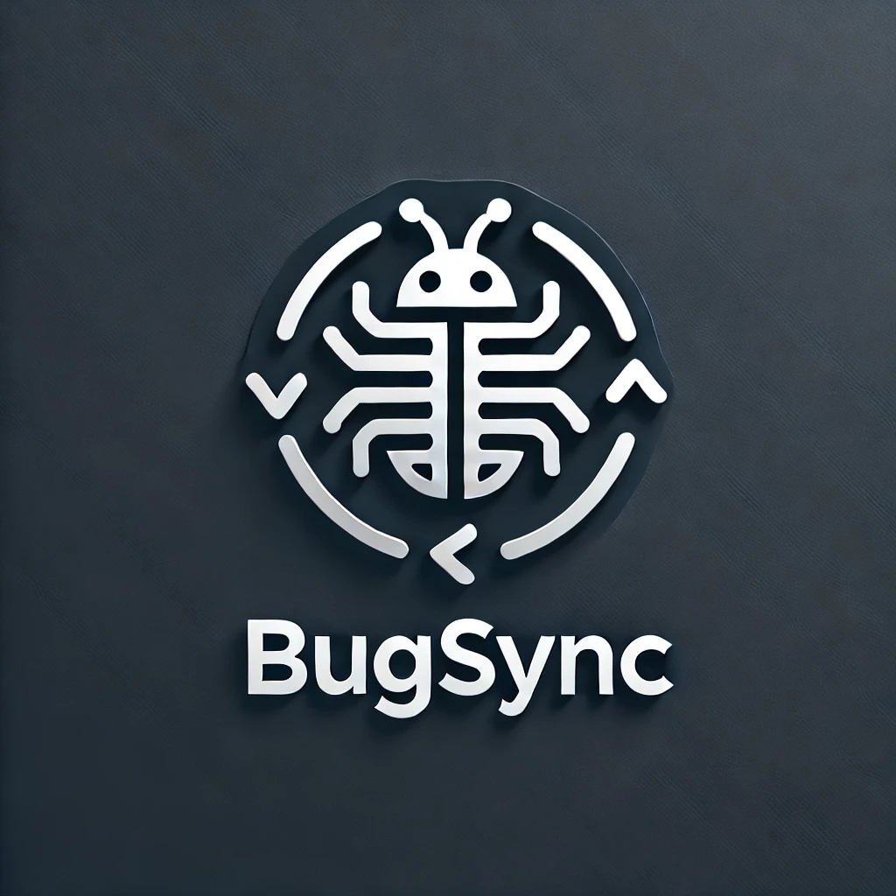
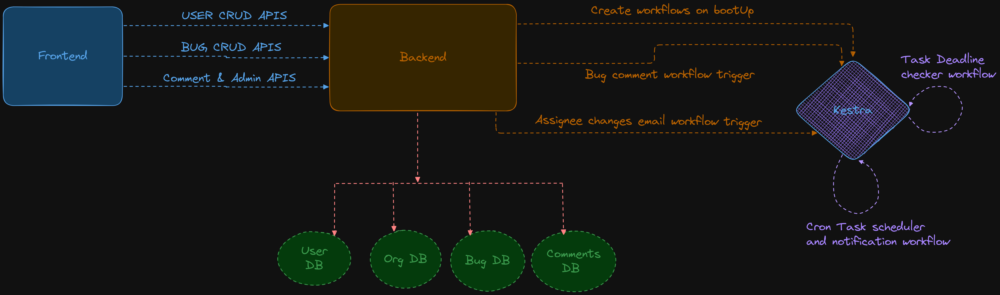

<div align="center">
    <h1>Bug-Sync Platform</h1>
  
</div>

**Bug-Sync Platform** is a powerful platform designed to streamline bug tracking, assignment, and management for development teams. The system automates bug distribution based on developer availability, skills, and priorities, ensuring efficiency and productivity. It also incorporates scheduling and notification layers using **Kestra**, making it highly scalable and reliable.

---

## Table of Contents

1. [Features](#features)
2. [Technologies Used](#technologies-used)
3. [Kestra Integration](#kestra-integration)
4. [Architecture](#architecture)
5. [Project Structure](#project-structure)
6. [Installation](#installation)
7. [API Documentation](#api-documentation)
8. [Contributing Guidelines](#contributing-guidelines)
9. [Acknowledgements](#acknowledgements)

---

## Features

### Core Objectives:
- Automatic assignment of bugs to developers based on availability, skills, and priority.
- User sign-up/login functionality.
- Bug management:
    - Add, edit, delete, and comment on bugs.
    - Assign severity, deadlines, and categories to bugs.
- Developer dashboard:
    - View assigned bugs, open bugs, and bug details.
    - Update personal information such as availability and skills.
- Admin dashboard:
    - Manage users and assign roles.
    - Add or modify modules/categories for bugs.
    - Manual override for bug assignments.
- Automated notifications for bug assignments, deadlines, and comments.
- Role-based access control (RBAC) for secure user actions.

---

## Technologies Used

| Component               | Technology                    |
|-------------------------|-------------------------------|
| **Backend**             | NestJS                        |
| **Frontend**            | Angular                       |
| **Database**            | MongoDB                       |
| **Task Scheduler**      | Kestra                        |
| **Authentication**      | JWT (JSON Web Tokens)         |
| **Email Notifications** | Kestra Workflows              |

---

## Kestra Integration

### What is [Kestra](https://kestra.io/)?
Kestra is an open-source orchestration and scheduling platform designed to handle complex workflows, task automation, and event-driven processing. It is built for scalability and integrates seamlessly with cloud-native environments.

### Why Kestra for Bug-Sync?
In **Bug-Sync**, Kestra plays a pivotal role in automating bug assignment tasks and notification layers :
- **Bug Assignment Automation**: Runs scheduled tasks to assign open bugs based on developer availability, skills, and bug priority.
- **Notification Automation**:
    - Sends email/slack notifications when bugs are assigned.
    - Notifies developers a day before deadlines if bugs remain unresolved.
    - Alerts users when comments are added to bugs they are following.
- **Error Resilience**: Retry mechanisms for failed task executions.
- **Scalability**: Efficiently handles multiple workflows concurrently, ideal for growing team sizes and complex bug tracking needs.

### Benefits of Using Kestra:
1. **Ease of Scheduling**: Kestra simplifies the creation and management of cron-like schedules for automated tasks.
2. **Event-Driven Workflows**: Automatically triggers workflows based on system events (e.g., new bug added).
3. **Visibility**: Provides detailed logs and dashboards to monitor workflow execution.
4. **Extensibility**: Supports custom plugins for advanced use cases.
5. **Error Handling**: Built-in mechanisms to retry failed tasks and manage workflow states.

---

## Architecture

The **Bug-Sync Platform** follows a **modular architecture** to ensure maintainability, scalability, and separation of concerns.

### Key Components:
1. **Presentation Layer**:
   - Built with Angular, handles all user interactions and visualizations.
2. **Controller Layer**:
   - NestJS-powered APIs validate requests and manage routing.
3. **Service Layer**:
   - Implements the core business logic, ensuring that functionalities are modular and reusable.
4. **Data Access Layer**:
   - Manages database operations, leveraging MongoDB for a scalable and flexible data structure.
5. **Automation Layer**:
   - Driven by **Kestra** for task scheduling, notification workflows, and bug assignment automation.

### Dockerized Setup:
- All services, including the **backend**, **frontend**, **database (MongoDB)**, and **Kestra**, are containerized using **Docker**.
- This ensures consistency across development, staging, and production environments, as well as simplified deployment processes.
- **Benefits of Dockerization**:
  - **Scalability**: Allows easy scaling of services as demand grows.
  - **Isolation**: Ensures independent operation of each service, reducing conflicts and improving fault tolerance.
  - **Portability**: Applications can be deployed on any infrastructure supporting Docker.
  - **Ease of Deployment**: All services can be started or restarted seamlessly using a single `docker-compose` command.

---
## ARC Diagram

---

## Project Structure
```markdown
├── api-bug-sync/
|   ├── src/
|   │   ├── assets/
|   │   ├── config/
|   │   ├── constants/
|   │   ├── controllers/
|   │   ├── dtos/
|   │   ├── entities/
|   │   ├── guards/
|   │   ├── interfaces/
|   │   ├── middlewares/
|   │   ├── services/
|   │   ├── utils/
|   │   ├── api-bug-sync.module/
|   │   └── main.ts
|   ├── test/
|   ├── .eslintrc.js
|   ├── .gitignore
|   ├── .prettierrc
|   ├── Dockerfile
|   ├── docker-compose.yml
|   ├── tsconfig.json
|   ├── tsconfig.build.json
|   ├── package.json
|   ├── package-lock.json
|   └── README.md
├── web-bug-sync/
```
---
## Installation

To run the Bug-sync platfrom APIs locally, follow these steps:

1. Clone the repository:
```bash
git clone https://github.com/Maheshmali1/bug-sync
```
2. Navigate to the project directory:
```bash
cd api-bug-sync
```
3. Install the dependencies:
```bash
npm install
```
4. Start the application with dockerized environment:
```bash
docker compose --proflie prod up --build -d
```
---
## API Documentation

The Student Information management APIs come with interactive API documentation generated by Swagger UI. To explore the APIs and interact with them, click on the link below:

[API Documentation](https://www.postman.com/spaceflight-physicist-91362856/bug-sync-apis/collection/23dgnsi/api-bug-sync?action=share&creator=40109838&active-environment=40109838-abd06e99-2dcc-4032-a33d-ca4f92420e33)

[](https://app.getpostman.com/run-collection/40109838-6162439b-5d80-4558-a989-98aa10fc2bc3?action=collection%2Ffork&source=rip_markdown&collection-url=entityId%3D40109838-6162439b-5d80-4558-a989-98aa10fc2bc3%26entityType%3Dcollection%26workspaceId%3Dc89ad703-26af-46c9-9693-e7384c907e20)
---
---
# Contributing Guidelines

Thank you for considering contributing to the Bug-Sync Platform. We welcome any contributions that can help improve the project. To ensure a smooth and collaborative development process, please follow the guidelines below:

### Getting Started
1. Fork the repository.
2. Clone your forked repository to your local machine.
3. Install the project according to [installation](#installation) guidelines.

### Making Changes
1. Create a new branch for your feature or bug fix: `git checkout -b feature/my-new-feature` or `git checkout -b bugfix/issue-number`.
2. Make your changes and ensure that the code follows the existing coding style and conventions. 
3. .Update the README.md file if necessary to reflect the changes or additions you've made.
4. Commit your changes with a descriptive commit message: `git commit -m "Add feature: my new feature"`.

### Submitting a Pull Request
1. Push your changes to your forked repository: `git push origin feature/my-new-feature`.
2. Visit the original repository on GitHub and create a new pull request.
3. Provide a clear and concise description of your changes in the pull request description.
4. Include any relevant information that can help in reviewing and understanding your changes.
5. Ensure that the pull request title and description adhere to the project's guidelines.
6. Once submitted, a project maintainer will review your pull request and provide feedback.

### Code Style and Conventions
- Follow the existing coding style and conventions observed in the project.
- Adhere to the ESLint rules defined in the `.eslintrc.json` configuration file.
- Write descriptive variable and function names to enhance code readability.

### Documentation
- Update the README.md file to reflect any changes or additions made to the project.
- Document any new features, endpoints, or configuration changes.
- Ensure that the documentation is clear, concise, and easily understandable.

### Issues and Discussions
- Feel free to open issues to report bugs, suggest new features, or ask questions.
- Participate in discussions and provide constructive feedback to other contributors.

We appreciate your contributions to the project and look forward to working with you. Thank you for your support!


---
## Author

The Bug-Sync Platform is developed and maintained by [Mahesh Mali](https://github.com/Maheshmali1).

## Acknowledgements

We would like to express our gratitude to the open-source community for providing the tools and frameworks that made this project possible. We also extend our thanks to the contributors and users who have helped improve the system through feedback and suggestions.

Thank you for using the **Bug-Sync Platform**!

---